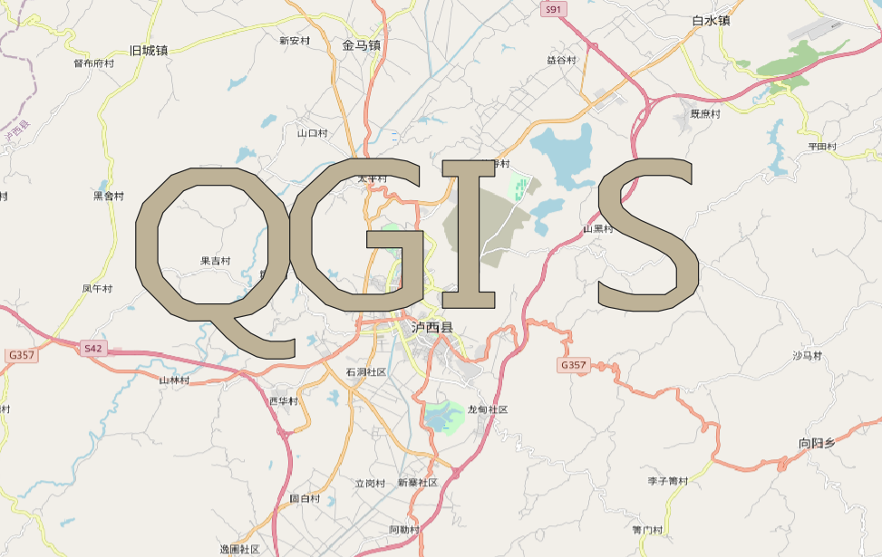
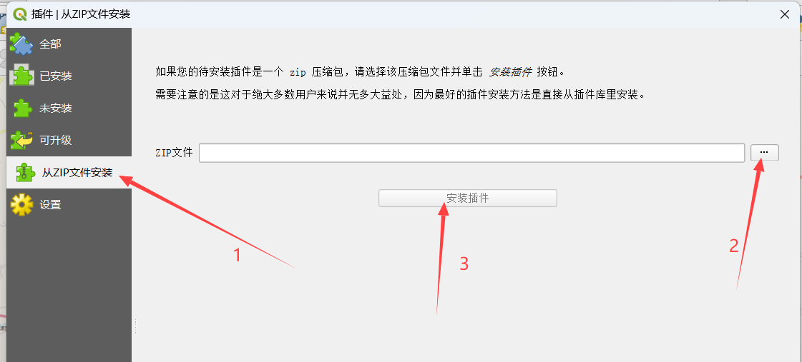
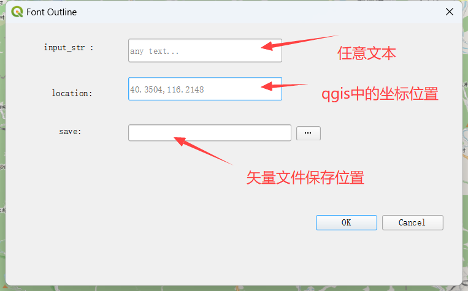

# QGIS Plugin FontOutline

将任意文本字符串转为`geojson`矢量数据的 qgis 插件。

## preview




## usage

### 安装

1. 克隆本仓库到`qgis`插件目录(windows 下是`~/AppData/Roaming/QGIS/QGIS3/profiles/default/python/plugins`)
   - 重启`qgis`会自动加载插件
   - 运行插件会自动安装依赖库`fonttools`到`qgis`python 默认依赖位置，如果报错可以自行下载或者使用方法 2
2. 下载[release 版本](https://github.com/ruierzhao/font_outline/releases/tag/release-v1.0.0)使用 qgis 从 zip 安装插件
   - 使用`qgis`插件安装工具
   - 

### 使用



1. 目前只支持`微软雅黑`字体(中英文都支持)。
2. `input_str`随便填。
3. `location`直接从`qgis`地图界面右键复制，目前经纬度坐标。
4. 保存位置可以自定义，默认保存位置为`~/Documents`,，默认文件名为`input_str`+随机字符串。
5. 字体实际宽度为`5000`米，高度使用字体原始宽高比确定，暂不支持自定义。

# dev

## 编译 ui 文件

```sh
# 设置 qgis 套件环境
o4w_env
# 编译 qrc 文件
pyrcc5 resources.qrc -o resources.py
# 编译 ui 文件
pyuic5 ui/main_ui.ui -o ui/main_ui.py
```

## todo

1. 中英文字体宽高调整适配，窄字符宽度调整
2. 字体实际宽度自定义
3. 目前只适配`微软雅黑`字体，添加其他字体适配
4. 国际化(i18n)完善
5. help 文档完善
6. 使用 docker 部署(使用 QgisApplication 初始化，脱离插件系统)

## attention

- 卸载插件之前先备份，尤其是在开发过程(卸载插件会删代码目录)🎃

# [LICENSE](LICENSE)
